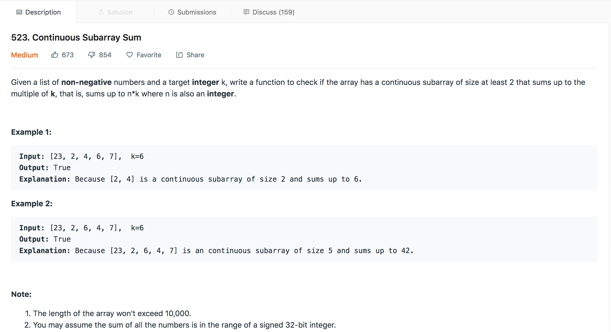
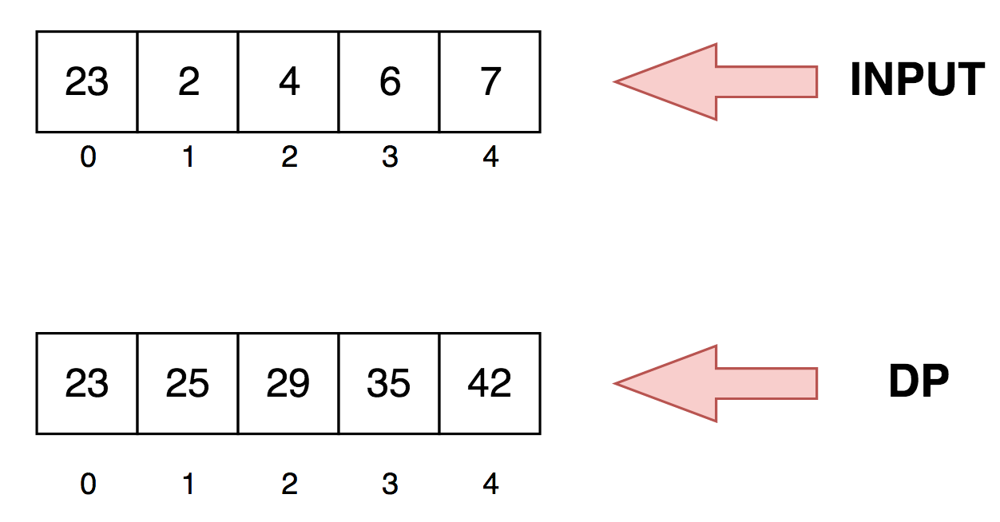

## Continous Subarray Sum

<p>

</p>

---

###  Motivation
We have been given an array and a number `K` and we have to find a continuous subset of the array whose sum when divided by k leaves remainder zero ie `nums[i:j]%K==0` or we can say that sum of the subset array is `N*K` where `N` can be any integer.   

We have to explicitily handle the case `K=0` because then `nums[i:j]%K` will throw a run time error. In such case the sum should be equal to zero.


### Solution-1 : Naive Way

The naive solution involves traversing all the subsets of `nums` array whose `length>=2` and checking for `nums[i:j]%K==0` where `i<j`. 

The solution provided is self descriptive as we won't be discussing about it in the article.

This solution will throw TLE `(Time Limit Exceeded)` error on leet code

#### Algorithm
1. 

### Solution-2 : Dynamic Programming
In Solution-1 we were repeatedly calculating the sum of the subsets. In computer science *we should remember our past otherwise we are condemned to repeart it*. 

Let's say 

```
sum[0:2] = nums[0] + nums[1] + nums[2]
sum[0:3] = nums[0] + nums[1] + nums[2] + nums[3]
```
then we can say that,

```
sum[0:3] = sum[0:2] + nums[3]
```

So from the above example we can see that if we store the summation values of subsets in a temporary array will save us from repetitive recomputation, which is a `Dynamic Programming` paradigm. 


We create a temporary called `dp` same length as of input where `dp[i]` denotes the summation of the elements of input array from 0 to i <b>th</b> index.

```
dp[i] = nums[0] + nums[1] +...+ nums[i]

```

<p>

</p>

Let's say `0<=i<j<N` where `i` and `j` are indexes of the input array and `N` is size of the input.

```
dp[i] = nums[0] + nums[1] +...+ nums[i]
dp[j] = nums[0] + nums[1] +...+ nums[i] + ... + nums[j-2] + nums[j-1] + nums[j]

```
then,

```
dp[j] - dp[i] = nums[i+1]+ nums[i+2]+ ... +nums[j-2] + nums[j-1] + nums[j]

```

So, the above formula helps us avoiding recompuation of summation of different subsets. 

#### Algorithm

### Solution-3 : Hashmap


#### Complexity Analysis

Solution-1

* Time Complexity: `O(N^3)` where `N` is the length of the input.
* Space Complexity: `O(1)`

Solution-2

* Time Complexity: `O(N^2)` where `N` is the length of the input.
* Space Complexity: `O(N)` where `N` is the length of the input. This space is occupied by `dp`

Solution-3

* Time Complexity: `O(N)` where `N` is the length of the input.
* Space Complexity: `O(N)` where `N` is the length of the input. This space is occupied by `dp`

#### Link to OJ
https://leetcode.com/problems/continuous-subarray-sum/

---
Article contributed by [Arihant Sai](https://github.com/Arihant1467)

