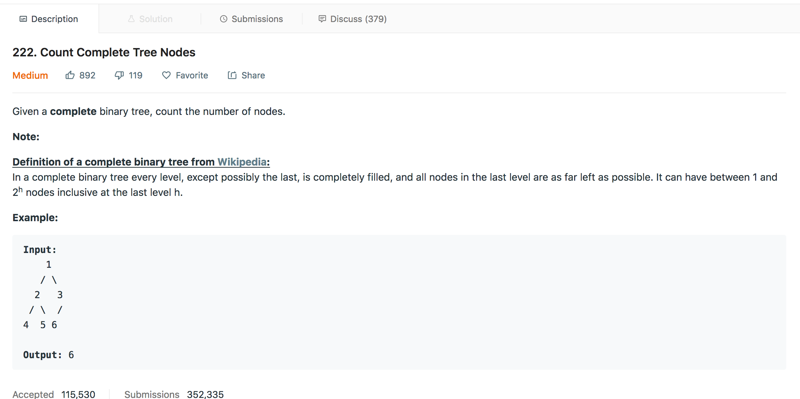

# Count Complete Tree Nodes

### Solution-1 : Level Order Traversal
1. At every level except the last, each level is completely filled.
2. If level of tree is `level=3`, then at `level=0` and `level=1` it will be completely filled.
3. So, the number of nodes in the at `level=0` and `level=1` is  summation of `2``0``+` `2``1`
4. Which is equal to `2``2``-1`
5. And then for the last level, we will calculate the total no of nodes in the last level.
6. We have used Level order traversal for this.

### Solution-2 : Inorder Traversal
1. We will traverse the tree in an inorder fashion and increment th count variable if we encounter any node. 

#### Complexity Analysis
- Solution: Level Order Traversal
    * Time Complexity: `O(N)` where `N` is the number of nodes.
    * Space Complexity: `O(N)` where `N` is the maximum number of nodes in a level

- Solution: Inorder Traversal
    * Time Complexity: `O(N)` where `N` is the number of nodes.
    * Space Complexity: `O(1)`

#### Link to OJ
https://leetcode.com/problems/count-complete-tree-nodes/

---
Article contributed by [Arihant Sai](https://github.com/Arihant1467)