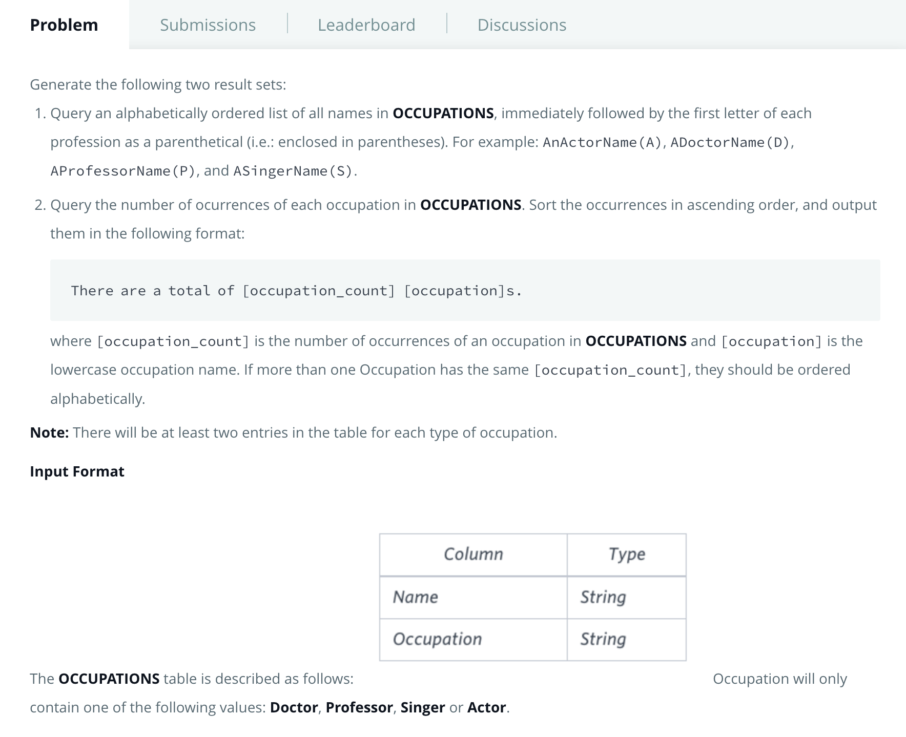
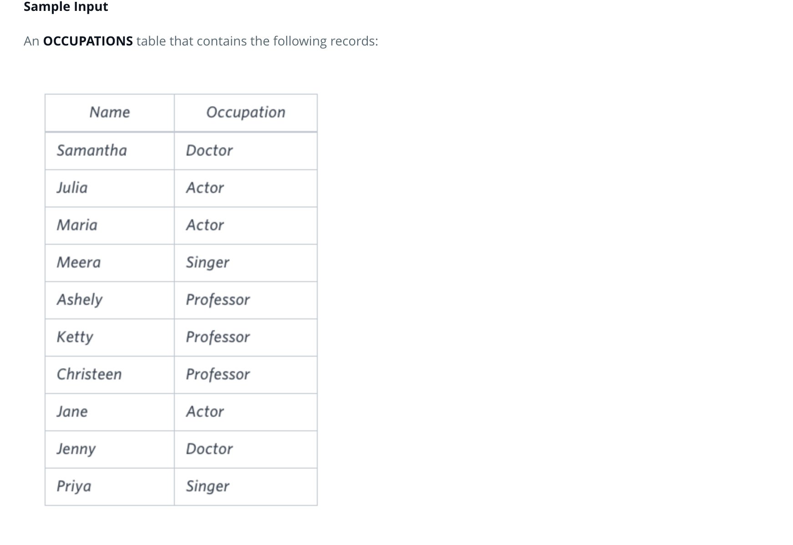

# Problem
[https://www.hackerrank.com/challenges/the-pads/problem](https://www.hackerrank.com/challenges/the-pads/problem)






#### SQL Query
```
SELECT CONCAT(NAME,'(',LEFT(OCCUPATION,1),')') AS N FROM OCCUPATIONS ORDER BY N;
SELECT CONCAT('There are total ',COUNT(OCCUPATION),' ',LCASE(OCCUPATION),'s.') FROM OCCUPATIONS GROUP BY OCCUPATION ORDER BY COUNT(OCCUPATION),LCASE(OCCUPATION); 
```

Important Points in the above query

- ';' semi colon allows sequential execution of statements
- CONCAT function function invoked to conact Strings.
- LEFT(OCCUPATION,1) to get first char from left of the coloumn value occupation
- multiple order clause are seperated by ',' comma.First Order by count,then if we have two same counts the ordering by occupation

