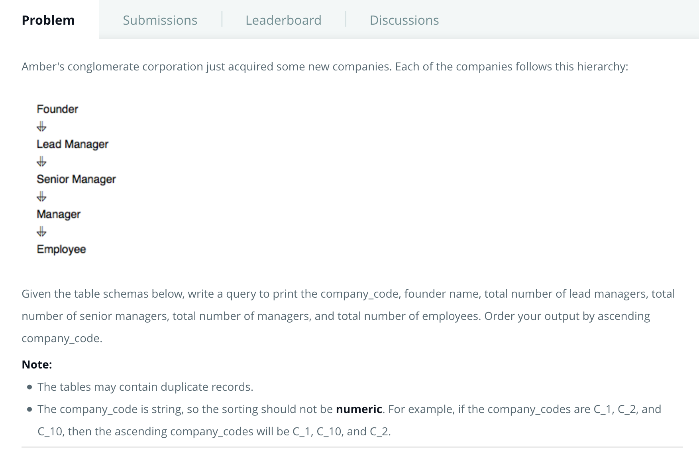

# Problem
[https://www.hackerrank.com/challenges/the-company/problem](https://www.hackerrank.com/challenges/the-company/problem)





#### SQL Query
```
SELECT c.Company_Code, c.founder, count(Distinct e.Lead_Manager_Code), count(distinct e.Senior_Manager_Code),
count(distinct e.Manager_Code),count(distinct e.employee_Code) FROM Company c JOIN Employee e ON 
c.Company_Code = e.Company_Code GROUP BY c.Company_Code, c.Founder ORDER BY c.COMpany_Code;
```


