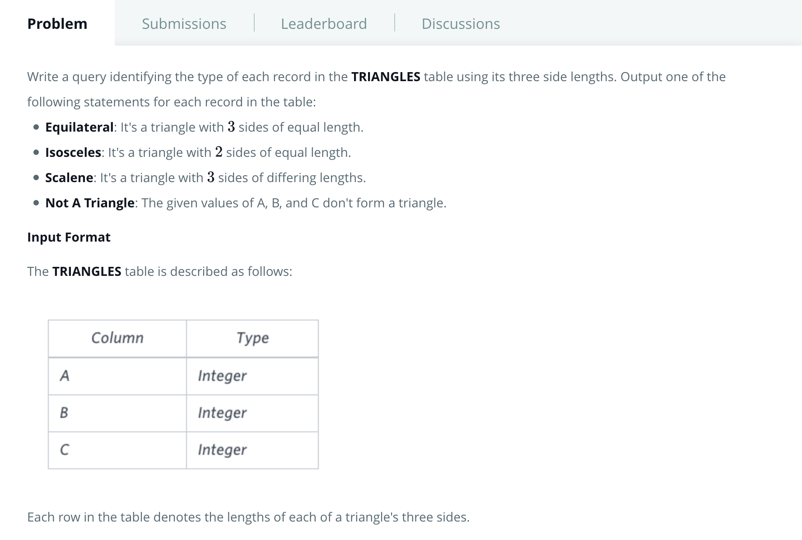
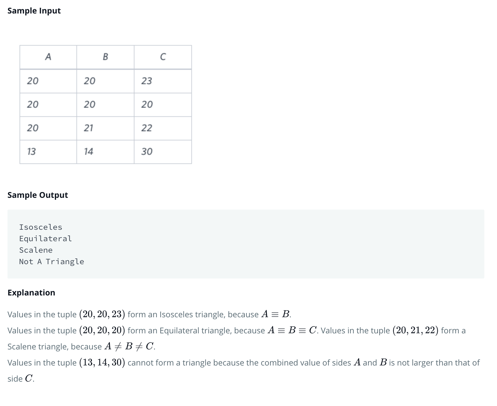

# Problem
[https://www.hackerrank.com/challenges/what-type-of-triangle/problem](https://www.hackerrank.com/challenges/what-type-of-triangle/problem)






#### SQL Query
```
SELECT CASE             
            WHEN A + B > C AND B + C > A AND A + C > B THEN
                CASE 
                    WHEN A = B AND B = C THEN 'Equilateral'
                    WHEN A = B OR B = C OR A = C THEN 'Isosceles'
                    ELSE 'Scalene'
                END
            ELSE 'Not Triangle'
        END
FROM TRIANGLES; 
```
First checking the property of triangle and then evaluting type of triangle rule
