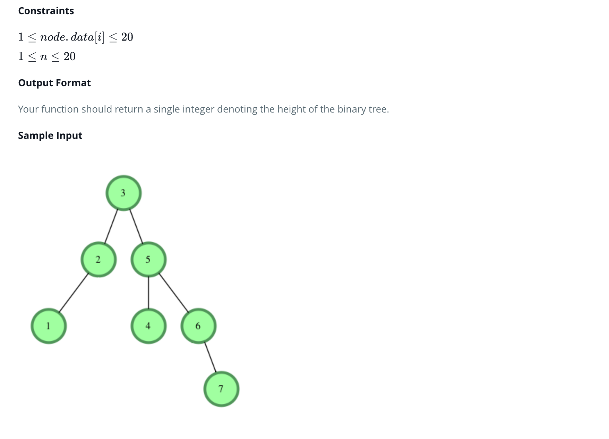

## Height Of A Binary Tree

---

### Solution : Preorder Traversal (Bottom Up fashion)

###  Motivation
We are given root of the tree and calculate height of the tree

### Approach

We will traverse the tree in an inorder fashion (bottom-up fashion). We calculate the heights of the left subtree and right subtree and return the `max` of both to the parent. 

### Algorithm
1. We start at the root of the tree

2. We check if the node is not `null`

3. Then we go into recursion for the `left` subtree and `right` subtree and calculate the respective heights

4. We return `1+max(heightOfLeftSubtree,heightOfRightSubtree)` to the parent node.

5. This process repeats in the recursion.

### Complexity Analysis
* Time Complexity: `O(N)` where `N` is the number of nodes in the tree.
* Space Complexity: `O(N)` where `N` is the number of nodes in the tree. The space is occupied by the recursion stack in this case.

### Link to OJ
[https://www.hackerrank.com/challenges/tree-height-of-a-binary-tree/problem](https://www.hackerrank.com/challenges/tree-height-of-a-binary-tree/problem)

---
Article contributed by [Arihant Sai](https://github.com/Arihant1467)
