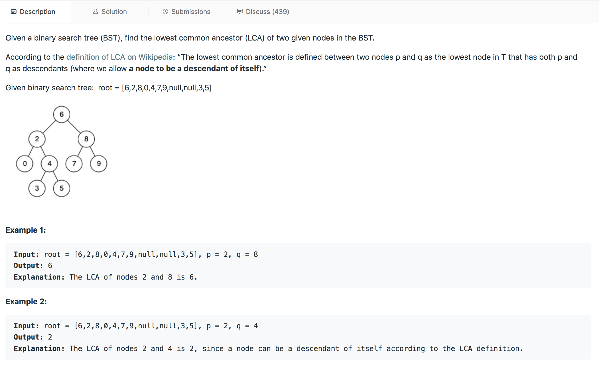

## Minimum Cost for Tickets

---

### Solution : Binary Search

####  Motivation
We need to find the lowest common ancestor of two nodes present in the tree

#### Algorithm
1. We check if the current node`s value greater than or smaller than the two nodes provided.
2. If both the nodes are smaller than the current node then the lowest common ancestor lies in left subtree.
3. If both the nodes are larger than the current node then the lowest common ancestor lies in right subtree.
4. if one is less than current node and other is greater than current nodes, then the current nodes is the lowes ccommon ancestor.

#### Complexity Analysis
* Time Complexity: `O(log N)` because we are reducing our search space after every visit.

#### Link to OJ
https://leetcode.com/problems/lowest-common-ancestor-of-a-binary-search-tree/

---
Article contributed by [Arihant Sai](https://github.com/Arihant1467)
