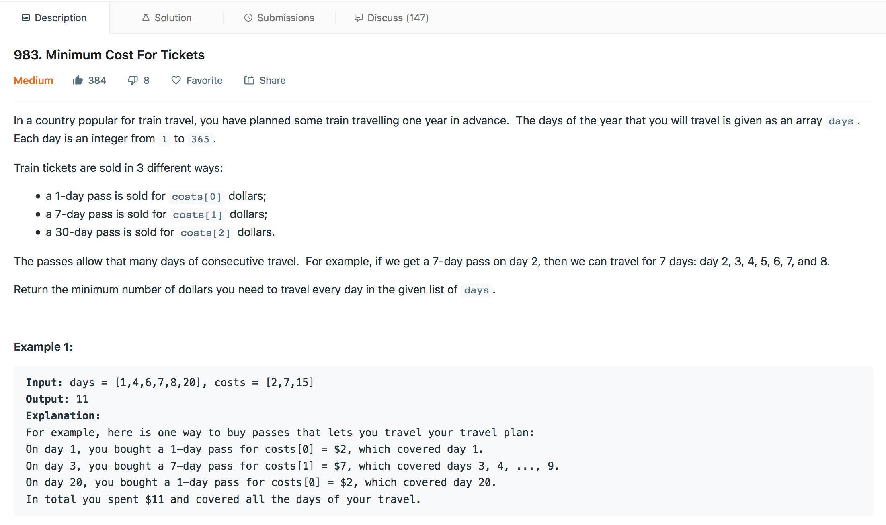

## Minimum Cost for Tickets




---

### Solution : Dynamic Programming

####  Motivation
We are given the days of travel and we need to find the minimum cost for the train travel. These days can span in the entire calender year

For each day present in the tour we will try to calculate the minimum cost required to travel `one day` before or `7 day` before or `1 week` before. 

The recursive relation involved for the solution
```
dp[i] = MINIMUM( dp[i-1]+cost[0]  ,  dp[i-7]+cost[1]  ,  dp[i-30]+cost[2]  )
```
where `i` represents `ith` day of travel which nees to be calculated


#### Algorithm
1. We create an array `dp` of `length=366` indexed with `0`. Where `dp[i]` denotes minimum cost for travel till `i`th day.  
2. We initialize all the elements of array with zero.
3. We create a `map` of days involved in the tour, this is only to make our search in constant time.
4. We only use the recursive relation for the travel day which is present in the map or else we just copy the previous index value.


#### Complexity Analysis
* Time Complexity: `O(1)` because we are taking constant time irrespective of number of input days.
* Space Complexity: `O(1)` because we are taking constant space irrespective of number of input days.

#### Link to OJ
https://leetcode.com/problems/minimum-cost-for-tickets/

---
Article contributed by [Arihant Sai](https://github.com/Arihant1467)
