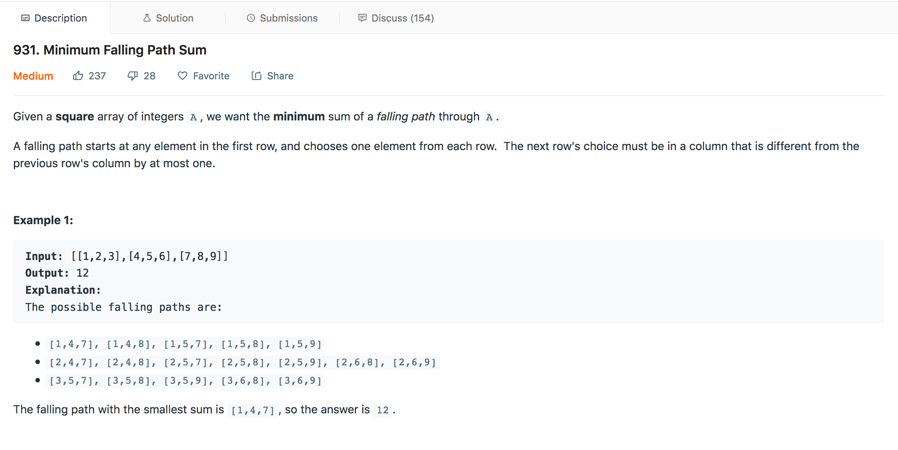

## Minimum Falling Path Sum

---

### Solution : Dynamic Programming

####  Motivation
We have to find the minimum path sum by choosing each element from every row and the points in the path should can differ in the column by at most one.

#### Algorithm

#### Complexity Analysis
* Time Complexity: `O(N^2 + N)` time taken to built our `dp` array and finding the minimum after last iteration .
* Space Complexity: `O(N^2)` the space taken by the `dp` array.

#### Link to OJ
https://leetcode.com/problems/minimum-falling-path-sum/

---
Article contributed by [Arihant Sai](https://github.com/Arihant1467)
