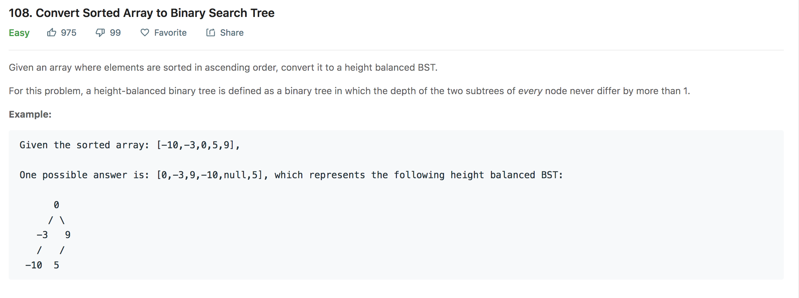

## Convert Sorted Array to Binary Search Tree

---

### Solution : Divide and Conquer
For a given sorted array there can be many structures of the tree possible. We here try to make a height balanced tree.

#### Algorithm
1. We find the `index` of middle element of the list. This element will be our root.
2. Now we divide the problem into left subtree and right subtree.
3. The list before the `index` of the middle element will be concerned with `left` subtree of `root` and list after    `index` will be concerned with `right` subtree of `root`.
4. The steps 1-3 will be repeated until the whole list is traversed.

#### Complexity Analysis
* Time Complexity: `O(N)` where `N` is the length of the list.
* Space Complexity: `O(N)` where `N` is the length of the list. The space is occupied by the recursion stack in this case.

#### Link to OJ
https://leetcode.com/problems/convert-sorted-array-to-binary-search-tree/

---
Article contributed by [Arihant Sai](https://github.com/Arihant1467)
