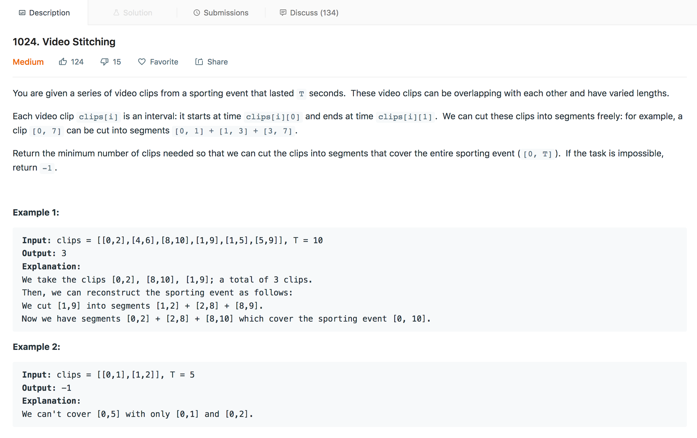
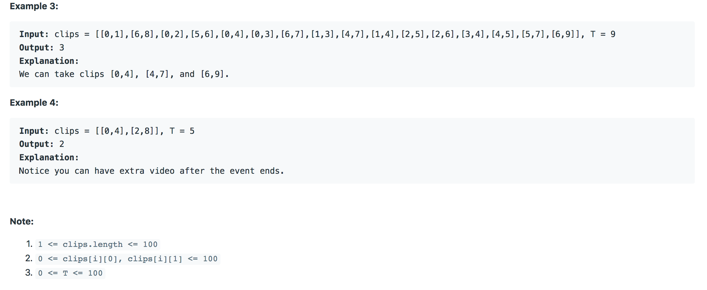

## Video Stitching

---

### Solution : Dynamic Programming

####  Motivation
We have to find the minimum path sum by choosing each element from every row and the points in the path should can differ in the column by at most one.

#### Algorithm
1. Create a class called `TimePoint` which will have start and end time values of each element in array

2. We create an array of objects of `TimePoint` called `timestamps`.

3. We will sort this array based on `start` point

4. For each object in the array we will try to gather the intervals in our list based on different conditions. The conditions are as follows:

- If the interval is covering a point not covered by the result list, add it to the result.
- If its leaving a gap, then we cant fill that gap, hence return -1
- If its overlapping, based on end time,
    - We can either discard this one, or
    - Include this one and replace the last interval of the result or
    - Append this one.

#### Complexity Analysis
* Time Complexity: `O(NlogN + N)` time taken to sort, create and traverse the `timestamps` array.
* Space Complexity: `O(N)` the space taken by the `timestamps` array.

#### Link to OJ
https://leetcode.com/problems/video-stitching/

---
Article contributed by [Arihant Sai](https://github.com/Arihant1467)
